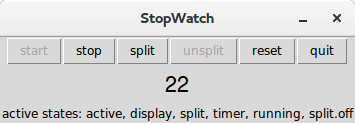

.. _integrate_code:

Integrating Sismic into code
============================

Sismic provides several ways to coexist the code and the statecharts.

The simplest approach is to directly integrate the code in statecharts.
This code can be eaisly integrated in YAML files, and then executed by Sismic (see :ref:`code_evaluation`).
However, this approach is quite limited: it does not allow the code to directly communicate
with the environment in which the statechart is executed.

There are basically two ways to allow the communication between a statechart and its environment:

1. The statechart contains both the behavior and the logic of your program, and you want to
   control the statechart from outside. The environment communicates with your statechart using
   events and exposed values.
2. The statechart only contains the behavior of your program. The environment contains the logic,
   and the program is controlled by the statechart.

In this document, we introduce two examples involving the same object, a stopwatch timer, to show
you how it is possible to make code and statecharts communicate.
These examples (including both the YAML definition and the code) are available in the *examples* directory
of Sismic's repository.

In a nutshell, the stopwatch is a timer than can start, stop and reset. It also provides a
split time feature and a display.

Unsurprisingly, the first example illustrates the first approach while the second examples illustrates the
second one.

Controlling the statechart within the environment
-------------------------------------------------

In this situation, we want the statechart to be driven by the environment.
In this example, the features of the stopwatch timer are contained in the statechart and are
triggered by external events. These events are described in the YAML definition hereafter.
The whole logic of our stopwatch is contained in the statechart:

 - there is a region that updates the time every second,
 - there is a region that stores the state of the split feature, and
 - there is a region that refreshes the display.

Notice how the statechart sends an *updated* event when its display is refreshed.
The value of this display is made available through the *display_time* variable of its context.

.. literalinclude:: ../../examples/stopwatch.yaml
    :language: yaml

The statechart is executed and synchronized with a graphical user interface defined using :py:mod:`Tkinter`.
Each button is bind to a Python method in which the corresponding event is created and sent to the statechart.
The timer value is displayed in the GUI each time the statechart sends an *updated* event (look at how we
:py:meth:`~sismic.interpreter.Interpreter.bind` the interpreter with the GUI).

Finally, the ``run`` method, which is put in Tk's mainloop, updates the internal clock of the interpreter
and executes the interpreter.

.. literalinclude:: ../../examples/stopwatch_gui.py
    :language: python

Controlling the environment within the statechart
-------------------------------------------------

For this second example, the statechart only contains the behavior of a stopwatch, not its logic.
The logic is defined in Python, and will be exposed to the statechart.
Here is a (quick and dirty) stopwatch in Python:

.. literalinclude:: ../../examples/stopwatch.py
    :pyobject: Stopwatch

The statechart expects such a ``Stopwatch`` instance to be created and provided in its initial context.
Recall that an :py:class:`~sismic.interpreter.Interpreter` accepts an optional ``initial_context`` parameter.
In this example, ``initial_context={'stopwatch': Stopwatch()}``.

The statechart is a lot simpler than the previous one. It is composed of two regions, one that handles the
running status of the stopwatch, and a second one that handles its split features.

.. literalinclude:: ../../examples/stopwatch_external.yaml
    :language: yaml

Finally, the code for our GUI does not differ much from the previous one.
Basically, there is no more a need for the GUI to listen to the events sent by the interpreter.
We only need to be able to send events to the statechart using ``send``. The *binding* between the
statechart and the GUI is done using the ``stopwatch`` object passed through the initial context of the interpreter,
not anymore using the ``bind`` method of the interpreter.

.. literalinclude:: ../../examples/stopwatch_gui_external.py
    :language: python