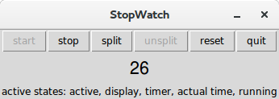
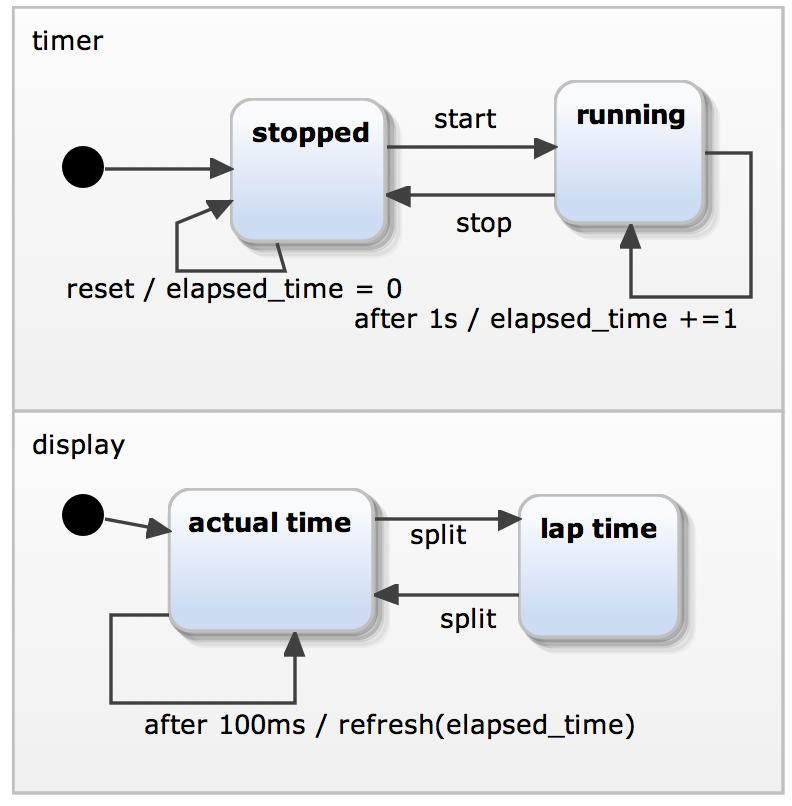

.. _integrate_code:

Integrating Sismic into your code
=================================

Sismic provides several ways to integrate executable statecharts into your source code.

We will illustrate this here by means of examples implemented in Python,
because this is also the language in which Sismic itself has been implemented.
If the statechart description itself does not use any Python specific code, however,
it should be relatively straightforward to integrate with code written in other programming languages as well.

There are basically three approaches to integrate statecharts with source code:
1. The simplest way is to directly *embed* the desired source code in the statechart description. An example was given in :ref:`code_evaluation`. The code is part of the YAML file of the statechart, and interpreted by Sismic during the statechart's execution. This approach has two main limitations: the statechart description depends on the programming language of choice; and the code cannot communicate with the environment in which the statechart is executed.
2. The statechart contains an internal memory (i.e., a set of variables that may change due to actions executed by the statechart). Source code is defined and executed in the external environment containing the statechart, and communicates with the statechart by sending it events, or receiving events from it.
3. The statechart does not contain any internal memory: it merely serves as the *main* loop of the program, which calls the necessary methods of the source code that defined in the external environment containing the statechart. Any *memory* (i.e., values of variables) is contained in the source code rather than the statechart.

Of course, one could also implement a hybrid approach, combining ideas from the three approches above.

Running example
---------------

In this document, we will present the main differences between the second and the third approach (see :ref:`code_evaluation` for the first approach), on the basis of a concrete example. The example illustrates how to implement a simple Graphical User Interface (GUI) whose behaviour is defined by a statechart. The example represents a simple stopwatch, that can be controlled by clicking on buttons defined in the GUI, as shown below:

Essentially, the stopwatch simply displays a value, representing the elapsed time (expressed in seconds), which is initially 0. By clicking on the *start* button the stopwatch starts running. When clicking on *stop*, the stopwatch stops running. By using *split*, the time being displayed is temporarily frozen, although the stopwatch continues to run. Clicking on *unsplit* while continue to display the actual elapsed time. *reset* will restart from 0, and *quit* will quit the stopwatch application.

All the source code and YAML files  for this example, discussed in more detail below, is available in the *examples* directory of Sismic's repository.

In a nutshell, the stopwatch is a timer than can start, stop and reset. It also provides a
split time feature and a display.

Controlling a statechart from within the environment
----------------------------------------------------

Let us first illustrate how to control a statechart through source code that executes in the environment containing the statechart. The statechart's behaviour is triggered by external events sent to it by the source code. Conversely, the statechart itself can send events back to the source code. 

Visually, the statechart looks as follows:

The YAML file containing the  textual description of this statechart, is given below:

.. literalinclude:: ../../examples/stopwatch.yaml
    :language: yaml

We observe that the statechart contains an elapsed_time variable, that is updated every second while the stopwatch is in the *running* state. The statechart will modify its behaviour by receiving *start*, *stop*, *reset* and *split* events from its external environment. In parallel to this, every 100 milliseconds, the *display* state of the statechart sends a *refresh* event (parameterised by the *elapsed_time* variable) back to its external environment. In the *lap time* state (reached through a *split* event) , this regular refreshing is stopped until a new *split* event is received.

The source code (shown below) that defines the GUI of the stopwatch, and that controls the statechart by sending it events, is implemented using the :py:mod:`Tkinter` library.
Each button of the GUI is bound to a Python method in which the corresponding event is created and sent to the statechart.
The statechart is *bound* to the source code by defining a new Interpreter that contains the parsed YAML specification, and using the :py:meth:`~sismic.interpreter.Interpreter.bind` 
method. The  *event_handler* passed to it allows the Python source code to receive events back from the statechart. In particular, the *w_timer* field of the GUI will be updated with a new value of the time whenever the statechart sends an *updated* event.
The ``run`` method, which is put in Tk's mainloop, updates the internal clock of the interpreter and executes the interpreter.

.. literalinclude:: ../../examples/stopwatch_gui.py
    :language: python

Controlling the environment from within the statechart
------------------------------------------------------

In this second example, we basically reverse the idea: now the Pyhton code that resides in the environment contains the logic (e.g., the elapsed_time variable), and this code is exposed to, and controlled by, a statechart that represents the main loop of the program and calls the necessary methods in the source code. These method calls are associated to actions on the statechart's transitions. 

The main difference with the solution above is that the statechart is no longer a *black box*, since it needs to be aware of the source code, in particular the methods it needs to call in this code.  An example of the Python code that is controlled by the statechart is given below:

.. literalinclude:: ../../examples/stopwatch.py
    :pyobject: Stopwatch

The statechart expects such a ``Stopwatch`` instance to be created and provided in its initial context.
Recall that an :py:class:`~sismic.interpreter.Interpreter` accepts an optional ``initial_context`` parameter.
In this example, ``initial_context={'stopwatch': Stopwatch()}``.

The statechart is simpler than in the previous example: one parallel regions handles the
running status of the stopwatch, and a second parallel region handles its split features.

.. literalinclude:: ../../examples/stopwatch_external.yaml
    :language: yaml

The Python code of the GUI no longer needs to *listen* to the events sent by the interpreter. It should, of course, continue to send events (corresponding to button presses) to the statechart using ``send``. The *binding* between the
statechart and the GUI is now achieved differently, by simply passing the ``stopwatch`` object to the Interpreter as its initial_context.

.. literalinclude:: ../../examples/stopwatch_gui_external.py
    :language: python